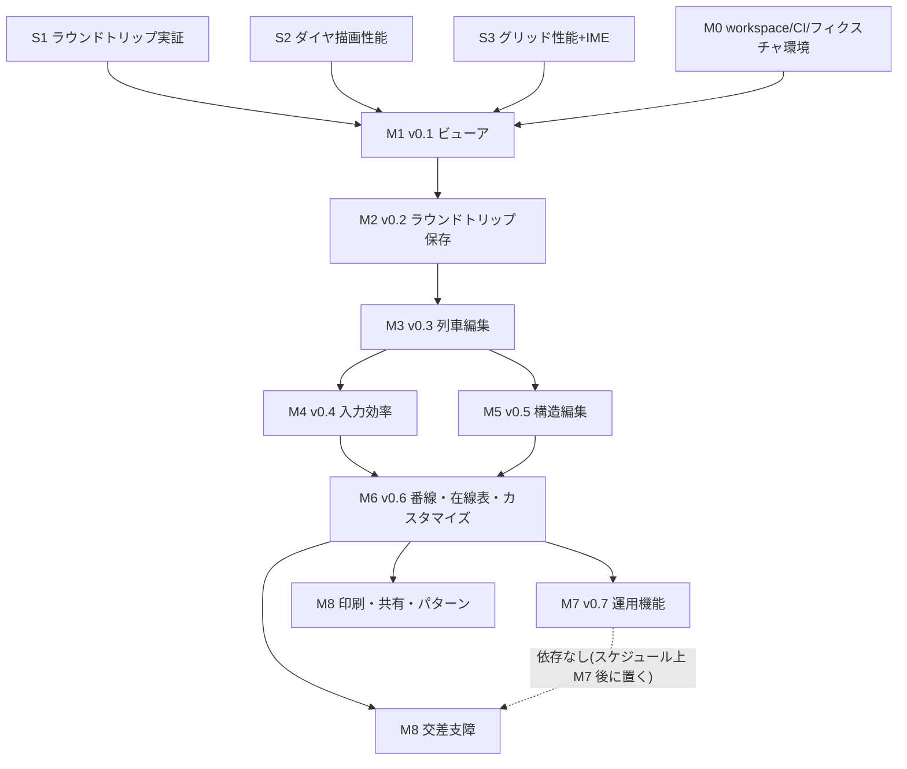

# 実装ロードマップ

本書は `docs/design/02_architecture.md`(以下「設計 §n」)で確定したアーキテクチャ・リリース段階(設計 §3.5 の v0.1〜v0.8)を、実装順序・完了条件・工数規模・依存関係まで具体化した実装計画である。機能の出所は `docs/analysis/01〜08`(以下「分析 §01」〜「分析 §08」)に対応付ける。

マイルストーンは **M0(開発基盤)+ M1〜M8(= リリース v0.1〜v0.8)** の 9 段階とする。M1 以降は各マイルストーン完了 = 一般公開リリースであり、「動くが出せない」中間状態を作らない。

---

## 1. マイルストーン一覧

| M   | リリース | 名称                             | 一言で                                                                       | 規模                    |
| --- | -------- | -------------------------------- | ---------------------------------------------------------------------------- | ----------------------- |
| M0  | —        | 開発基盤 + スパイク              | workspace・CI・3 スパイクで技術リスクを先に潰す                              | **M**                   |
| M1  | v0.1     | ビューア(MVP)                    | oud2/oud 全世代を読んで時刻表・ダイヤグラム・駅時刻表を閲覧。PWA オフライン  | **L**                   |
| M2  | v0.2     | ラウンドトリップ保存             | 無編集完全再保存のバイト一致 CI ゲート稼働。互換の信頼を確立                 | **M**                   |
| M3  | v0.3     | 列車編集                         | コマンド + patch Undo/Redo、駅時刻・列車ダイアログ、列単位コピペ             | **L**                   |
| M4  | v0.4     | 入力効率(価値の中核)             | 連続入力・時補完・繰上げ伝播・Ctrl+J/K/L・ピリオド再実行・直通化/分断/一本化 | **L**                   |
| M5  | v0.5     | 構造編集                         | 駅・種別・ダイヤ編集と整合カスケード、路線プロパティ、組入れ/切り出し        | **L**                   |
| M6  | v0.6     | 番線・在線表・カスタマイズ時刻表 | 番線編集 UI、ダイヤグラム在線表、冊子風時刻表                                | **M**                   |
| M7  | v0.7     | 運用機能                         | 運用探索 Worker、運用表/一覧表/一覧図、箱ダイヤ、入出区連携コード一覧        | **XL**                  |
| M8  | v0.8+    | 仕上げ                           | 交差支障チェック、パターンダイヤプレビュー、印刷、静的リンク共有             | **M**(項目単位で分割可) |

規模の目安(個人開発の相対工数): **S** = 数日〜1 週間、**M** = 2〜4 週間、**L** = 1〜2 か月、**XL** = 2 か月超。M1・M3〜M5 が L、M7 が XL で、全体の重心は「M1(読む)→ M2(書く)→ M4(打つ)」の前半 3 山と M7 の後半 1 山にある。

---

## 2. 最初に潰すべき技術リスクとスパイク(M0 内で実施)

M0 では恒久コードを書く前に、以後の全計画の前提となる 3 つの不確実性を使い捨てスパイクで検証する。**いずれかが失敗した場合の代替案まで含めて先に決めておく。**

### スパイク S1: oud2 ラウンドトリップ最小実証(最重要)

- **検証内容**: OuPropertiesText パーサ(CR 除去 → BOM 判定 → UTF-8/SJIS デコード → ノードツリー)+ ノードツリーをそのまま書き戻すシリアライザを書き、**sample2.oud2 で「読込 → 書出 → バイト一致」**を成立させる。この段階ではドメイン型への変換をせず、ノードツリー ↔ バイト列の可逆性だけを証明する(分析 §03 の文法仕様)。
- **合格条件**: sample2.oud2 のバイト一致。加えて旧世代フィクスチャ(1.00 / 1.05 / 1.09 / 1.10 / 1.16 の oud2 と OuDia.1.02 の .oud。入手・作成方法は M0「フィクスチャ環境」参照)が全てパースエラーなく読める。
- **失敗時の対処**: 文法解釈の誤り(ディレクトリ判定・エスケープ・同名キー順)は分析 §03 とソース(`CConvNodeContainer.cpp`)の再照合で解決する。この層で一致しないなら以後の全互換戦略が崩れるため、**S1 合格まで M1 に進まない**。
- **規模**: S。成果物のパーサはそのまま `@oudia-web/format` の初版になる(捨てない唯一のスパイク)。

### スパイク S2: Canvas ダイヤグラム描画性能

- **検証内容**: 500 列車 × 50 駅相当の合成データで、4 レイヤ Canvas + rAF 全再描画 + ビューポートカリング(設計 §5.1)のプロトタイプを書き、スクロール/ズーム時のフレーム時間を実測する。回転ラベル(`ctx.rotate`)・線種 4 種(`setLineDash`)・±86400 秒シフト重複描画を含める。
- **合格条件**: MacBook 級で 60fps(フレーム 16ms 以内)、ミドルレンジ Android で 30fps 以上。
- **失敗時の対処**: (i) スジレイヤの Path2D キャッシュ化、(ii) ラベルレイヤのスクロール中省略描画、の順に追加。WebGL への転換はしない(設計 §5.1 で不採用確定。座標変換層があるため将来差し替えは可能)。
- **規模**: S。プロトタイプは捨て、計測ハーネスのみベンチマーク基盤(§7)に残す。

### スパイク S3: Canvas 時刻表グリッド性能 + IME オーバーレイ

- **検証内容**: 800 列 × 200 行相当の合成 CellSpec で、可視域のみ描画する Canvas グリッド(固定 2 列 + 固定ヘッダ行、種別別フォント/色、縦書きセル)のスクロール性能を実測する。同時に、フォーカスセル位置への透明 `input` オーバーレイで (a) 日本語 IME 入力が確定文字列を取れること、(b) 数字キー押下 →「初期文字列付き `<dialog>` 起動」(CKeyinputSenderToModalDlg 代替、分析 §04)が Chromium/Firefox/Safari で動くことを確認する。
- **合格条件**: スクロール 60fps、IME 確定文字列の取得と dialog へのキー転送が 3 ブラウザで成立。
- **失敗時の対処**: IME はオーバーレイ input を常設(隠しフォーカスホルダ)方式へ変更。性能はセル描画のオフスクリーンタイルキャッシュを追加。DOM 仮想化グリッドへの転換はしない(設計 §5.2 で不採用確定)。
- **規模**: S。

### M0 のその他の作業(スパイクと並行)

- pnpm workspaces 雛形(`packages/format|domain|derive|render`、`apps/web`)、依存方向 lint(設計 §3.2)、TypeScript strict + `exactOptionalPropertyTypes`。
- CI: Vitest(Node)、Playwright 枠、**ライセンスチェック**(GPLv3 非互換依存の混入防止、設計 §10)、ベンチマーク記録枠。
- リポジトリの GPLv3 整備: COPYING、ライセンスヘッダ、原著作者クレジット(設計 §10)。
- フィクスチャ環境: Windows 版 OuDiaSecond 2.06.23(実機 or VM)を用意する。**現行版の書き出しは常に最新 FileType(1.17)と .oud(OuDia.1.02)のみで、旧世代 oud2 形式(1.00〜1.16)では保存できない**(分析 §03)。したがって旧世代 oud2 フィクスチャ(1.00 / 1.05 / 1.09 / 1.10 / 1.16 の代表版)は、(a) 過去リリースの OuDiaSecond バイナリ(Ver1.00 系 / 1.04 系 / 2.03 系等)を入手して各版で保存する、または (b) 分析 §03 の世代別キー仕様から手書きで作成し、現行 Windows 版で開けることを検証する、のいずれかで用意する。.oud(OuDia.1.02)フィクスチャと各種期待値ファイルは現行 Windows 版の書き出しで生成できる。現行版は **M2・M7 のテスト期待値生成(旧世代 → 1.17 変換結果・.oud・OperationTableContent)に必須のインフラ**であり、ここで先に確立する。

**M0 完了条件**: S1〜S3 全合格 + CI が空パッケージ群で green + フィクスチャの入手・作成・検証手順のドキュメント化。

---

## 3. 各マイルストーンの詳細

### M1(v0.1)ビューア — 「スマホでダイヤが見られる」

**目的**: 読み込み系(format の 4 世代リーダー)・ドメイン型・導出レイアウト・Canvas 描画という縦の全層を、編集なしの最小構成で貫通させ、単独価値のあるビューアとして公開する。

**含む機能**(→ 出所):

| 機能                                                                                                                                                                                     | 出所                |
| ---------------------------------------------------------------------------------------------------------------------------------------------------------------------------------------- | ------------------- |
| OuPropertiesText パーサ + 世代別リーダー 4 系統(1.10-1.17 / S09 / S05 / S00・OuDia1.02)、寛容読込規則、SJIS 0x5C ハック                                                                  | 分析 §03            |
| `RosenFileData` 型定義(index 参照モデル、駅作業 discriminated union、Seconds ブランド型 + null)                                                                                          | 分析 §02、設計 §4.1 |
| 時刻演算(`compareJikoku` 循環比較・`subJikoku`・decode)                                                                                                                                  | 分析 §02、設計 §4.2 |
| `computeDiagramLayout`(entDgr パイプライン忠実移植: 差分累積 X・駅間最小所要秒数・長時間停車補完・60 秒閾値折り直し・線形補間・`createEstimateRessya`)                                   | 分析 §05            |
| `cellSpec` 純関数(通常時刻表のみ。表示トグル(分析 §04 §7.4 の `m_bDisplayTsuukaEkiJikoku`(既定 true)等)は M1 では**原典 .ini 既定値で固定**し、トグル UI は M4 の表示トグル群で実装する) | 分析 §04            |
| Canvas グリッド基盤(固定行列・スクロール。フォーカス/選択は M3 へ)+ 時刻表レンダラ(記号 ﾚ/                                                                                               |                     | /・・/----/○/====、種別別フォント・色、縦書き) | 分析 §04、設計 §5.2 |
| ダイヤグラムレンダラ(4 レイヤ、罫線 8 択テーブル、回転ラベル、停車駅明示 ○、日跨ぎ重複描画、離散ズーム、ダブルクリック → 時刻表遷移)                                                     | 分析 §05、設計 §5.1 |
| 駅時刻表ビュー(読み取り専用: 発時刻の時バケツ分け・行き先略称・当駅始発 ●)                                                                                                               | 分析 §04            |
| React シェル: ファイルを開く(File System Access + input フォールバック)、路線ツリー、ビュー記述子キーのタブ管理(二重オープン防止)                                                        | 分析 §01、設計 §4.5 |
| PWA(vite-plugin-pwa、全アセット precache、完全オフライン)                                                                                                                                | 設計 §8.2           |
| モバイル対応(タッチスクロール・ピンチを離散ズームへマップ)                                                                                                                               | 設計 §8.3           |

**閲覧のみで含まない**: 保存・編集・Undo・運用系ビュー・カスタマイズ時刻表(読込はするが「未対応」表示)。運用作業データ(Operation キー)は**読込・保持のみ**行い表示しない。

**完了条件**:

1. sample2.oud2 と旧世代フィクスチャ(1.00/1.05/1.09/1.10/1.16/OuDia.1.02)が全てエラーなく開け、時刻表・ダイヤグラム・駅時刻表が Windows 版のスクリーンショットと目視一致する(**比較は双方とも原典 .ini 既定のトグル状態で行う**。比較チェックリストを docs に残す)。
2. `computeDiagramLayout` の座標スナップショットテスト(長時間停車・日跨ぎ・通過推定・経由なしの境界ケース)が green。
3. 500 列車 × 50 駅ベンチで S2/S3 の合格基準を製品コードで再達成。
4. 機内モードで PWA が起動しファイルを開ける。
5. iOS Safari / Android Chrome で閲覧操作が成立する。

**規模**: L(本計画最大級。format リーダー M + derive レイアウト M + render 2 種 M + シェル S の合算)。

---

### M2(v0.2)ラウンドトリップ保存 — 互換の信頼を確立

**目的**: 「OuDiaSecond のファイルを壊さない」ことを CI とアプリ内機能の両方で証明可能にする。以後の全編集機能の安全網。

**含む機能**:

| 機能                                                                                                                                                         | 出所                      |
| ------------------------------------------------------------------------------------------------------------------------------------------------------------ | ------------------------- |
| 現行 1.17 ライター(出力条件テーブル駆動: true のみ出力・非デフォルト時のみ出力・同名キー順・時刻書式・COLORREF %08X・フォント書式)                           | 分析 §03 §5 表、設計 §6.1 |
| EkiJikoku / Operation 文字列の逐次スキャンシリアライザ(入れ子作業 `Operation13B.0A` 形式含む)                                                                | 分析 §03                  |
| 未知キー・未知ノードの位置保持と書き戻し + WindowPlacement 透過書き戻し                                                                                      | 設計 §6.1・§4.5           |
| **バイト一致黄金テストの CI 必須ゲート化**(カスタム差分レポータ付き)                                                                                         | 設計 §7.1                 |
| 旧世代読込 → 1.17 書出の期待値比較(1.00〜1.16 各代表 + OuDia.1.02。期待ファイルは現行 Windows 版で生成)                                                      | 設計 §7.1                 |
| 保存 UI: 上書き保存(Chromium)/ ダウンロード保存(他)、.oud 書き出し(encoding-japanese、機能喪失警告ダイアログ文言踏襲)                                        | 分析 §03、設計 §6.2-6.3   |
| ストアの `executeCommand()` チョークポイント + patch 履歴 + 変更カウンタ(保存 0/変更 +1/Undo -1/負から編集で INT_MAX)— 最小コマンド `comment/set` で稼働開始 | 分析 §01、設計 §4.3-4.4   |
| コメント編集(CRfEditCmd_Comment 相当、LF 正規化)= 初の編集コマンドかつ Undo/Redo の実証                                                                      | 分析 §06                  |
| OPFS 自動バックアップ(編集契機 60 秒、世代保存)+ 起動時クラッシュ復元提案                                                                                    | 分析 §01、設計 §6.3       |
| アプリ内「互換セルフチェック」(開く → 保存 → 差分ゼロ確認、匿名化差分レポート任意提出)                                                                       | 設計 §6.4                 |
| CSV 書き出し(時刻表 CSV・駅時刻表 CSV)                                                                                                                       | 分析 §01                  |

**完了条件**:

1. コーパス全ファイル(sample2.oud2 + 番線/分岐環状/運用/カスタマイズ時刻表を含む自作フィクスチャ 10 本以上)で「読込 → 無編集 → 書出 → バイト一致」が CI green。**このゲートは以後恒久的にマージ条件**。
2. Windows 版 ⇔ Web 版で同一ファイルを交互に 3 往復してもバイト列が安定する。比較は **FileTypeAppComment 行を正規化(除外)のうえ行う**(両者はアプリ名 + 版をこの行に書くため必ず不一致になる。設計 04 §5.2 T2 と同一規則)。WindowPlacement は「Windows 版側でウインドウ配置を変えない」ことを比較手順書に固定したうえで、透過書き戻しの安定を確認する。
3. コメント編集 → Undo → Redo → 保存 → 変更カウンタが原典仕様通り遷移する Vitest が green。
4. タブクラッシュ(強制終了)→ 再起動で直前 60 秒以内のバックアップから復元できる E2E が green。
5. .oud 書き出しが Windows 版生成の期待値(oud-export/sample2.expected.oud)と一致し、機能喪失(loss)レポートの内容検証が green(設計 04 §5.2 T6)。
6. 時刻表 CSV・駅時刻表 CSV 書き出しのスナップショットテストが green。

**規模**: M(ライターはテーブル駆動で機械的。テスト・フィクスチャ整備が半分を占める)。

---

### M3(v0.3)列車編集 — 編集アプリになる

**目的**: 列車 1 列単位の編集体系(コマンド + patch Undo + ダイアログ + コピペ)を確立する。以降の M4 はこの上の操作追加のみ。

**含む機能**:

| 機能                                                                                                                  | 出所                  |
| --------------------------------------------------------------------------------------------------------------------- | --------------------- |
| `ressya/replaceRange` コマンド(CRfEditCmd_Ressya 相当、生成モード NewItem/Focus/Select/All)+ `ressya/swap`            | 分析 §04              |
| コマンド型ディスパッチのビュー差分更新(`ressya/replaceRange` → 該当列のみ再構築)                                      | 分析 §01、設計 §4.4   |
| グリッドのフォーカスセル・箱型選択(Shift)・ランダム選択(Ctrl)・キーボードナビ                                         | 分析 §01 CWndDcdGrid  |
| `usePropEdit` フック(StartEdit/OnUiChanged 正規化/EndEdit 検証)+ ネイティブ `<dialog>`                                | 分析 §01 CPropEditUi2 |
| 駅時刻ダイアログ(decode・2 桁時補完 ±1 時間・番線選択)、列車プロパティダイアログ(種別/番号/名前/号数/備考/運休)       | 分析 §04              |
| キー押下 → 初期文字列付きダイアログ起動(S3 で実証済みの方式)+ 確定後フォーカス移動(下/右モード)                       | 分析 §04              |
| 列単位の切り取り/コピー/貼り付け/消去(非連続選択可)、**貼り付け移動量の累積加算**(秒/列車番号/号数、コピーでリセット) | 分析 §04              |
| クリップボード: アプリ内は内部形式、外部へはテキスト表現(独自バイナリ形式は再現しない)                                | 分析 §01              |
| 通過(時刻消去)/通過-停車トグル/経由なし/時刻消去/当駅始発/当駅止り/運休、駅時刻挿入・削除(Ctrl+R/E 相当)              | 分析 §04              |
| 新規列車追加(グリッド末尾列)、列車削除                                                                                | 分析 §04              |
| キーマップ基盤(PWA=原典バインド / タブ表示=代替バインドの自動切替、ユーザ設定)                                        | 設計 §9.4             |
| 列車番号検索(検索ダイアログバー相当。Canvas グリッドのブラウザ内検索不可の補償)                                       | 設計 §9.3             |

**完了条件**:

1. 「新規列車を駅時刻ダイアログだけで入力 → ダイヤグラムに即反映 → Undo 100 回 → Redo 100 回 → 保存」が破綻しない(patch 対称性の Vitest + E2E)。
2. 編集後保存ファイルを Windows 版で開き、同一編集を Windows 版で行った結果とバイト一致する(代表 5 シナリオ。FileTypeAppComment 行は正規化のうえ比較、以下 M4 も同じ)。
3. 貼り付け移動量によるパターンダイヤ連続貼り付け(10 分間隔 ×10 本)が原典と同結果。
4. 編集反映 16ms 以内(500 列車ベンチ、コマンド実行 + 列再構築 + 再描画)。

**規模**: L(グリッド対話系 + ダイアログ 2 種 + コマンド基盤の本格稼働)。

---

### M4(v0.4)入力効率 — 価値の中核

**目的**: 原典マニュアル 2.3 章「列車のいろいろな入力方法」(分析 §08 が Tier2 = 価値の中核と認定)のキーボード入力体系を完全再現し、既存ユーザの移行を成立させる。

**含む機能**(全て分析 §04):

- 連続入力モード(Ctrl+T): 分 2 桁連続タイプ、時は直前駅から補完(前駅より小さければ +1 時間)、BackSpace 1 文字訂正 → 前駅戻り、Esc 終了、終着自動終了、運行なし駅の停車化 + 基準番線適用。
- [駅時刻の繰上げ・繰下げ] 伝播(modifyCentDedEkiJikoku 相当: 当該駅以後の全駅時刻へ差分伝播)+ Rev 系(Alt: 以前の駅へ)。
- 連続 1 分修正(Ctrl+J/K/L 系、フォーカス行種別による多態: 駅時刻 ±1 分/番線/種別/列車番号)。
- 駅時刻変更の再実行(ピリオドキー、CentDedRessya_EkijikokuModifyOperation2 相当の変更内容記憶と連続適用)。
- 時刻のみ貼り付け(直通化手動)、直通化/分断、列車番号で一本化(CRessyaContUnifier 相当: 番号非空一致 + 種別一致のマージ)。
- 並べ替え 4 方式(フォーカス行で方式決定: 駅扱/乗継/種別/備考ソート。CDedRessyaSoater 相当、選択範囲のみ可)。
- 最小所要時間列車に移動、表示トグル群(全時刻/通過駅時刻/秒/コロン/2400 等 約 12 種、localStorage 永続化)。
- **Playwright キーボード回帰テストの整備**(マニュアル 2.3 章をシナリオ一次ソースに、PWA/タブ両キーマップモードで実行)。

**完了条件**:

1. マニュアル 2.3 章の全操作手順を E2E シナリオ化し green(連続入力・時補完・繰上げ/繰下げ・Ctrl+J/K/L・ピリオド・パターン貼り付け・直通化 3 方式・分断・並べ替え)。
2. 各操作の結果ファイルが Windows 版での同一操作結果とバイト一致(代表 10 シナリオ。FileTypeAppComment 行は正規化のうえ比較)。
3. 乗継ソートが `createEstimateRessya` の推定時刻を用いて原典と同順序になる。

**規模**: L(1 機能ずつは S だが点数が多く、E2E 整備を含む)。

---

### M5(v0.5)構造編集 — 路線を作れる

**目的**: 駅・種別・ダイヤの増減という「index 再マップを伴う編集」を解禁し、ゼロからの路線作成ワークフロー(新規作成 → 駅 → 種別 → ダイヤ → 列車入力)を完成させる。

**含む機能**:

| 機能                                                                                                                                                                                                                      | 出所                |
| ------------------------------------------------------------------------------------------------------------------------------------------------------------------------------------------------------------------------- | ------------------- |
| 新規路線ファイル作成                                                                                                                                                                                                      | 分析 §08            |
| 駅ビュー(行 = 駅グリッド)+ 駅プロパティダイアログ(駅時刻形式 6 種・駅規模・番線リストは M6 で編集可・分岐駅/環状線・路線外発着駅・駅名略称・次駅距離)                                                                     | 分析 §06            |
| `eki/replaceRange` コマンドと**整合カスケード忠実移植**(erase/set/insert → adjustBrunchLoop → 駅時刻形式正規化 → 番線/路線外駅 index 再マップ(-1=削除)→ 交差支障ルール調整 → 作業調整。OperationConnect は M7 まで no-op) | 分析 §06、設計 §4.3 |
| 種別ビュー + 種別プロパティ(名称/略称/文字色/フォント/背景色/線スタイル/停車駅明示/親種別/隠し種別)、swap 時の全列車 index 再マップ、使用中種別の削除禁止                                                                 | 分析 §06            |
| ダイヤ一覧ダイアログ(即時反映方式: 新規/コピー/削除/上下/プロパティ)+ ダイヤプロパティ(名前一意・背景色)                                                                                                                  | 分析 §06            |
| 路線ファイルのプロパティ 4 タブ(路線/フォント・色/時刻表/ダイヤグラム: 起点時刻・既定駅間幅等)                                                                                                                            | 分析 §06            |
| 駅・種別の行単位カット/コピー/ペースト                                                                                                                                                                                    | 分析 §06            |
| 路線ファイルの組入れ/切り出し                                                                                                                                                                                             | 分析 §08            |
| ダイヤ削除時の該当タブ自動クローズ(ビュー記述子の整合性検証)                                                                                                                                                              | 分析 §01、設計 §4.5 |
| 時刻表 CSV インポート                                                                                                                                                                                                     | 分析 §01            |

**完了条件**:

1. **整合カスケードのプロパティベーステスト常設**: 任意の駅追加/削除/並べ替え・種別入替・分岐環状設定変更の後に「全列車の駅時刻数 = 駅数」「全参照 index の全域有効性」「分岐環状派生マップの再計算一致」が成立(fast-check 等で数千ケース)。
2. 支線分岐路線の構成定石(同名駅 2 回登場 + 分岐駅設定、分析 §08)をゼロから作成 → ダイヤグラムが原典と同形状 → 保存 → Windows 版で開けて同一表示、の E2E が green。
3. 駅削除 → Undo で駅時刻・作業・番線参照が完全復元される(patch 方式により原典の「Rosen 全体保存」分岐なしで成立することの確認)。
4. 新規作成 → 保存したファイルを Windows 版が警告なく開ける。

**規模**: L(カスケードの移植とプロパティテストが重い。ダイアログ点数も最多)。

---

### M6(v0.6)番線・在線表・カスタマイズ時刻表

**目的**: OuDiaSecond 差別化機能の土台である番線システムを編集可能にし、表示系拡張 2 種を足す。M7 運用機能の前提データを揃える。

**含む機能**:

| 機能                                                                                                                                                                                  | 出所          |
| ------------------------------------------------------------------------------------------------------------------------------------------------------------------------------------- | ------------- |
| 番線編集(CentDedEkiTrack2: 名称・時刻表略称・上り略称、下り/上り主本線、ダイヤ表示省略)+ 番線増減時の全ダイヤ全列車再マップ                                                           | 分析 §06      |
| 時刻表グリッドの番線行表示・番線変更(Ctrl+J/K/L の番線多態は M4 で骨格済み)                                                                                                           | 分析 §04      |
| ダイヤグラム在線表(RessyaTrackLine: 番線別横太線・転線縦線。出区 ○/入区 △ 等の運用記号は M7)+ 在線表表示駅での折れ線分割                                                              | 分析 §05      |
| カスタマイズ時刻表(CustomizeJikokuhyouContent の非運用部分: 1 列複数列車チェーンの冊子風レイアウト、cellSpec 拡張、駅の下り/上り各 16 表示設定と駅ビューの表示設定モード一括サイクル) | 分析 §04・§06 |
| カスタマイズ時刻表 CSV                                                                                                                                                                | 分析 §01      |

**完了条件**:

1. 番線増減 → 再マップのプロパティテスト green(M5 の常設テストに番線系を追加)。
2. 在線表付きフィクスチャの表示が Windows 版と目視一致し、ラウンドトリップがバイト一致を維持。
3. カスタマイズ時刻表の代表フィクスチャが Windows 版とセル単位で一致(スナップショット比較表を docs に残す)。

**規模**: M(在線表とカスタマイズ時刻表は表示中心。編集コマンドの新設は番線のみ)。

---

### M7(v0.7)運用機能 — 最大の山

**目的**: OuDiaSecond 独自の運用機能(分析 §07)を iEnableOperation 0→1→2 の順に解禁する。CDedOperationConnecter(10,247 行)の忠実直訳が中心で、**テスト先行**を厳守する。

**内部フェーズ分割**(この順で出す。各フェーズ完了ごとにリリース可):

1. **M7a テストハーネス**: Windows 版で「入力 oud2 → OperationTableContent / 割当運番 / カスタマイズ時刻表併合結果」の入出力ペアを大量生成する仕組み(デバッグ出力 or 保存ファイル経由)を作り、フィクスチャ 30 本以上を先に確保する。**移植コードより先にテストが存在する状態を作る**(設計 §7.3)。
2. **M7b 簡易モード(iEnableOperation=1)**: 駅作業編集 UI(前後作業ダイアログ: 7 種 discriminated union、増解結入れ子)、時刻表の作業行・入線時刻行表示、探索の接続処理のみ(運番割当なし)を Worker(Comlink)で実行。
3. **M7c 通常モード(iEnableOperation=2)**: 運番伝播・折返し反転・接尾辞 ";n" 処理・運用番号変更・仮運番/空白運番・増結待機ループ・入出区連携コード 1:1 引継ぎ、の全アルゴリズム直訳。導出値はストア外キャッシュへ(設計 §4.1)。
4. **M7d 運用系ビュー**: 運用表(従来形式 + 箱ダイヤ形式)、運用一覧表 + 運用一覧図(**1 ビューモデル + 2 レンダラで統合**、設計 §3.5)、入出区連携コード一覧、ダイヤグラムの出区 ○/入区 △/運用番号/接続円弧描画、運用表 CSV・運用一覧表 CSV。時刻表の運用番号行・次列車接続タイプによる併合表示。更新一時停止 + 手動更新(F5 相当)。

**完了条件**:

1. M7a フィクスチャ全件で「同一入力 → 同一 OperationTableContent・同一割当運番」の比較テスト green(**バイト一致ゲートと並ぶ M7 の必須ゲート**)。
2. 運用編集 → 探索完了までの間、前回結果が表示され続け UI 入力が 16ms 応答を維持(500 列車ベンチで探索は Worker 側数百 ms 許容)。
3. 運用作業を含むファイルのラウンドトリップがバイト一致を維持(入れ子作業 `Operation13B.0A` 含む)。
4. 運用一覧表のソート 5 種が原典と同順序。

**規模**: XL。**息切れ対策**: v0.1〜v0.6 は運用なしで製品として完結しているため(設計 §9.2)、M7 は中断・再開が可能。M7b で一度リリースして反応を見る。

---

### M8(v0.8 以降)仕上げ — 独立項目のバックログ

**目的**: 相互依存のない上級機能群。順不同・項目単位でリリースする。

| 項目                      | 内容                                                                                                                                                        | 出所                | 規模 |
| ------------------------- | ----------------------------------------------------------------------------------------------------------------------------------------------------------- | ------------------- | ---- |
| 交差支障チェック          | CrossingCheckRule 編集ダイアログ + 判定の derive 抽出・Worker 実行(2 ポインタ時隔窓、分岐環状同一駅群)+ 結果ビュー(明示実行、時刻表/ダイヤグラムへジャンプ) | 分析 §07            | M    |
| パターンダイヤプレビュー  | サイクル秒シフト複製列車の重畳描画 + ダイヤプロパティの周期設定                                                                                             | 分析 §05            | S    |
| 印刷                      | OffscreenCanvas ページ分割 → ブラウザ印刷/PDF(余白設定 mm 単位)。10 ビュー分を主要 4 ビュー(時刻表/ダイヤグラム/駅時刻表/運用表)から順次                    | 分析 §01、設計 §5.3 | M    |
| 静的リンク共有            | ファイルを URL フラグメント(圧縮 + Base64)または静的ホストで共有する閲覧専用リンク                                                                          | 設計 §3.5           | S    |
| 将来: CRDT 共同編集の調査 | patch 履歴 = 操作ログの載せ替え可能性検証。実装はスコープ外                                                                                                 | 設計 §3.5           | —    |

**完了条件**(項目ごと): 交差支障は Windows 版と同一ルール・同一ダイヤで同一の該当組リストを出すこと。印刷は A4 縦横で Windows 版印刷結果とレイアウト目視一致。

---

## 4. 依存関係

ブロック関係の要点:

- **S1 は全ての前提**。ノードツリー往復が成立しなければ format 戦略ごと見直しになるため、最初に着手する。
- **M2(バイト一致ゲート)は M3 以降の全編集機能をブロックする**。編集を先に作ると「壊れた保存」を検出できないまま進むため、順序交換は不可。
- **M4 と M5 は M3 の上で独立**。並行可能だが、個人開発では M4(既存ユーザ価値)を先にする。M5 の完了は M4 に依存しない。
- **M6 は M5 に依存**(番線再マップは駅編集カスケードの拡張)し、**M4 にも依存する**(時刻表グリッドの番線変更は M4 で作る Ctrl+J/K/L 多態の骨格を前提)。**M7 は M6 に依存**(運用探索は番線データが前提。分析 §08 の「番線 → 運用 → 箱ダイヤ」依存順)。
- **交差支障(M8)は M7 に依存しない**が、番線(M6)には依存する。運用と独立に前倒し可能だが、利用者層が重なるため M7 後に置く。
- 横断基盤の初出タイミング: `executeCommand`/patch 履歴 = M2(comment/set で最小稼働)、グリッド選択系 = M3、Worker 基盤(Comlink)= M7b(それまで Worker 不要)、キーマップ二重化 = M3。

---

## 5. 対象外・延期機能

| 機能                                                                   | 扱い                     | 理由                                                                                                               |
| ---------------------------------------------------------------------- | ------------------------ | ------------------------------------------------------------------------------------------------------------------ |
| WinDIA 入出力                                                          | **対象外**               | 原典 Ver1.02 で削除済み(分析 §08)。互換対象に含まれない                                                            |
| 外部時刻表インポート(JR 東/西/北海道)                                  | **対象外**               | 事業者サイトのスクレイピング依存で保守不能・法的リスク(分析 §08 が省略候補と認定)。時刻表 CSV インポート(M5)で代替 |
| ウインドウ配置の復元(WindowPlacement の解釈)                           | **対象外**(書き戻しのみ) | Web のタブ UI に MDI 子ウインドウ座標は写像不能。ファイル互換は透過書き戻し(M2)で完全に守る(設計 §4.5)             |
| セル単位の Excel 的編集                                                | **対象外**               | 原典に存在しない操作体系(編集は列車 1 列/駅 1 行単位、分析 §08)。互換操作体系を優先                                |
| 独自クリップボードバイナリ形式の互換                                   | **対象外**               | Windows 版プロセスとのクリップボード相互運用はブラウザから不可能。アプリ内内部形式 + テキスト表現で代替(M3)        |
| ドラッグでのスジ引き・時刻修正                                         | **対象外**(当面)         | 原典ダイヤグラムは表示専用(分析 §05)。互換再現が完了し要望が確認できるまで着手しない                               |
| Undo 深さ 8 固定の再現                                                 | **対象外**               | 既定 100・設定可変に拡張(設計 §4.4)。ファイル互換と無関係な内部仕様のため改善側に倒す                              |
| zod 等スキーマバリデーション、Radix 等 UI ライブラリ、Turborepo、WebGL | **対象外**               | 設計 §1.2 で不採用確定                                                                                             |
| 運用機能・交差支障・印刷・パターンダイヤプレビュー                     | **延期**(M7/M8)          | iEnableOperation 分離線・Tier4 判定(分析 §08)に基づく計画的延期                                                    |
| i18n(多言語化)                                                         | **延期**(無期限)         | UI は日本語のみ(設計 §8.4)。既存ユーザが日本語話者                                                                 |
| ファイル共有サーバ・共同編集(CRDT)                                     | **延期**(調査のみ M8)    | サーバ不要のクライアント完結が前提。patch 履歴が操作ログとして残るため後付け余地は確保済み                         |
| 過去 oud2 形式(1.16 以前)での**書き出し**                              | **対象外**               | 原典も現行形式でのみ保存する。読込互換のみ提供                                                                     |

---

## 6. 品質ゲート

### 6.1 恒久ゲート(導入後、全 PR のマージ条件)

| ゲート                             | 導入 M             | 内容                                                                                                      |
| ---------------------------------- | ------------------ | --------------------------------------------------------------------------------------------------------- |
| 型 + lint + 依存方向               | M0                 | strict TS、format←domain←derive←render←app の一方向 lint、ライセンスチェック                              |
| **バイト一致黄金テスト**           | M2                 | コーパス全ファイルで読込 → 書出 → バイト一致。差分はキーパス付きレポート。**失格 = マージ不可の絶対条件** |
| ドメイン不変条件(プロパティテスト) | M5                 | 全列車の駅時刻数 = 駅数、参照 index 全域有効性、分岐環状派生マップ整合(M6 で番線系を追加)                 |
| ベンチマーク追跡                   | M1                 | 500 列車 × 50 駅でレイアウト計算・全再描画・コマンド実行の所要時間を CI 記録、前回比 20% 劣化で fail      |
| Playwright E2E                     | M3(骨格)/ M4(本格) | キーボード操作回帰、PWA/タブ両キーマップ                                                                  |
| **運用探索比較テスト**             | M7                 | Windows 版と同一入力 → 同一 OperationTableContent。M7 以降のマージ条件                                    |

### 6.2 マイルストーン別の検収内容(リリース判定)

| M   | テスト重点                                                                                           | 互換性検証(Windows 版との突き合わせ)                                                                                                                                   |
| --- | ---------------------------------------------------------------------------------------------------- | ---------------------------------------------------------------------------------------------------------------------------------------------------------------------- |
| M0  | スパイク 3 件の合格基準                                                                              | フィクスチャ入手・作成・検証手順の確立(旧世代 1.00〜1.16 は過去版バイナリ入手 or 手書き + 現行版での読込検証、.oud・期待値ファイルは現行版で生成)                      |
| M1  | computeDiagramLayout 座標スナップショット、cellSpec スナップショット、4 世代リーダー単体、性能ベンチ | 表示の目視一致チェックリスト(時刻表・ダイヤグラム・駅時刻表 × 代表 5 ファイル)                                                                                         |
| M2  | 黄金テスト稼働、変更カウンタ仕様、クラッシュ復元 E2E                                                 | 3 往復バイト安定(FileTypeAppComment 行正規化)、旧世代(1.00〜1.16・OuDia.1.02)→ 1.17 変換の期待値一致、.oud 書き出し期待値一致(設計 04 T6)、時刻表 CSV スナップショット |
| M3  | patch Undo/Redo 対称性、編集反映 16ms                                                                | 編集 5 シナリオの保存結果バイト一致                                                                                                                                    |
| M4  | マニュアル 2.3 章 E2E 全シナリオ                                                                     | 入力 10 シナリオの保存結果バイト一致、乗継ソート順一致                                                                                                                 |
| M5  | カスケードのプロパティテスト常設、駅削除 Undo 完全復元                                               | 支線分岐路線ゼロ作成 E2E、新規ファイルを Windows 版で開けること                                                                                                        |
| M6  | 番線再マップのプロパティテスト                                                                       | 在線表・カスタマイズ時刻表の表示一致 + ラウンドトリップ維持                                                                                                            |
| M7  | 比較テストフィクスチャ 30 本以上・テスト先行、Worker 非ブロック性能                                  | OperationTableContent 一致、運用込みラウンドトリップ、ソート 5 種順序一致                                                                                              |
| M8  | 交差支障の該当組一致、印刷レイアウト目視一致                                                         | 項目ごとに個別検収                                                                                                                                                     |

### 6.3 リリース共通チェック(全 M)

- 対応 3 ブラウザ(Chrome/Firefox/Safari)+ モバイル 2 系での起動・ファイル開閉のスモークテスト。
- PWA オフライン起動確認(機内モード)。
- GPLv3 表記(バージョン情報のクレジット・ソースリポジトリリンク)とリリースタグ ⇔ ソース対応の確認(設計 §10)。
- 互換セルフチェック機能(M2 以降)で収集した差分レポートのトリアージ: バイト不一致報告は次リリース前に原因確定させる(修正またはコーパス追加)。
